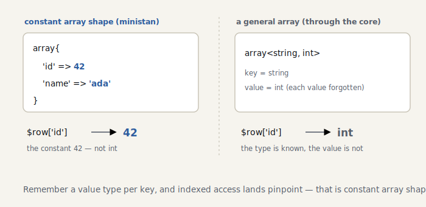

# S2 — Going deeper into arrays

> *The code for this chapter lives in the snapshot [`impls/looking-glass/02-arrays`](../../../impls/looking-glass/02-arrays) — a slice of the live `dev/` tree taken at `git tag seasoned-02`.*

> **Further reading** (optional): TAPL ch. 11 §11.8, “Records.” An array that carries a type per key is, in type-theory terms, a structural **record type**.

PHP code is awash in arrays. In the basics volume we waved arrays through as `mixed`. In this chapter we go one level deeper — into **what’s inside** the array.

```php
$row = ['id' => 42, 'name' => 'ada'];
$id = $row['id']; // is this an int? No — it’s exactly 42
```

## Constant array shapes

The type of `['id' => 42]` shouldn’t be `array<string, int>` — it should be **`array{id: 42}`**. We know the value type at each key, and that is exactly [`ConstantArrayType`](../../../impls/looking-glass/02-arrays/src/Type/Constant/ConstantArrayType.php) (PHPStan’s constant array shape). Constant types work on arrays too:

```php
public function getOffsetValueType(Type $offset): Type
{
    foreach ($this->keyTypes as $i => $keyType) {
        if ($keyType->equals($offset)) {
            return $this->valueTypes[$i]; // matched key: return its value type, pinpointed
        }
    }
    return $this->getIterableValueType(); // unknown offset: the union of all value types
}
```

<picture>
  <source media="(prefers-color-scheme: dark)" srcset="../figures/s2-array-shape-dark.svg">
  
</picture>

> **Reference note:** an array carrying a type per key is exactly the type-theory **record type** (TAPL ch. 11 §11.8). Whether one record fits another — the subtype relation — is measured by two rules: **width** (extra keys are fine) and **depth** (if each key’s value type is a subtype, so is the whole), TAPL ch. 15 §15.2. That `array{id: 42}` fits inside `array{id: int}` is depth subtyping. When `accepts` compares keys and values recursively, it is tracing this same idea.

## Inferring array literals

We add array literals to `Scope::getType()`. If every key is constant, we build a shape; otherwise we fall back to a general `ArrayType` ([`arrayLiteralType`](../../../impls/looking-glass/02-arrays/src/Analyser/Scope.php)):

```php
if ($item->key === null) {
    $keyType = new ConstantIntegerType($nextInt); // auto-incrementing key
    $nextInt++;
} else {
    $keyType = $this->getType($item->key);
    if ($keyType instanceof ConstantIntegerType) {
        $nextInt = max($nextInt, $keyType->value + 1);
    } elseif (!$keyType instanceof ConstantStringType) {
        $isConstant = false; // if the key isn’t constant, it can’t form a shape
    }
}
```

An array access `$row['id']` then returns the value type at that key when the operand is a shape, and the element type when it’s a general array.

## The element type of a `foreach`

In the basics volume, `$v` in `foreach ($arr as $v)` was `mixed`. Now that we know an array’s element type, we can give `$v` the right type ([`processForeach`](../../../impls/looking-glass/02-arrays/src/Analyser/NodeScopeResolver.php)):

```php
$iterableType = $scope->getType($node->expr);
$loopScope = $this->processAssignTarget($node->valueVar, $this->iterableValueType($iterableType), $loopScope);
```

## Run it

```console
$ dev/bin/ministan annotate array.php
     3  $row    : array{id: 42, name: 'ada'}
     4  $id     : 42
     5  $name   : 'ada'
     6  $nums   : array{0: 1, 1: 2, 2: 3}
     8  $double : int        ← the foreach element $n is known to be int
```

## Self-analysis set the next homework

When we wrote this chapter’s code and ran it on itself, it scolded us:

```
Call to an undefined method Ministan\Type\Type::getIterableValueType().
```

Inside the **arm of a `match (true)`** — `match (true) { $x instanceof ArrayType => $x->getIterableValueType() }` — we weren’t narrowing `$x` (whereas an `if ($x instanceof …)` would narrow it). For now we sidestepped it by rewriting the code with an `if`, but **narrowing inside a match arm** became homework for a later chapter — having the analyzer write its own roadmap is the real pleasure of dogfooding.

## Summary

- `ConstantArrayType` keeps the value type per key, so `$row['id']` is inferred pinpoint-precisely.
- Array literals become a shape when every key is constant, and fall back to `ArrayType` otherwise.
- The element and key types of a `foreach` are derived from the array type.
- Self-analysis handed us the next piece of homework: narrowing inside a `match` arm.

Next, in S3, we step into **generics** (`@template T`) — the chapter where the type system’s design decisions are tested in earnest.
