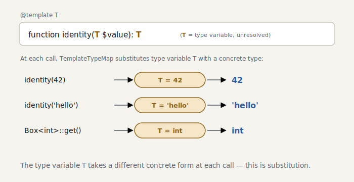

# S3 — Generics

> *The code for this chapter lives in the snapshot [`impls/looking-glass/03-generics`](../../../impls/looking-glass/03-generics) — a slice of the live `dev/` tree taken at `git tag seasoned-03`.*

> **Further reading** (optional): `@template T` is a universally-quantified type `∀T`, and pinning down its type argument is **substitution** — the textbook view is **TAPL** ch. 22 (type reconstruction) and ch. 23 (System F, parametric polymorphism), the genuine fit for what we build here. On the PHP side, the `@template` notation traces back to Hack’s generics, and **Psalm** (Matt Brown) pioneered it for plain PHP — the lineage every PHP analyzer now follows. One caveat for the theory-minded: ministan’s substitution is **one-directional** (a straight assignment of type variables), not the bidirectional unification TAPL’s reconstruction algorithm performs.

PHP has no language-level generics, but PHPDoc expresses them through `@template`. Whether
an analyzer can read that annotation is the dividing line of modern PHP static analysis.

> Unlike Java’s erasure or C#’s reified generics, PHP’s `@template` is **PHPDoc — a comment** —
> so the runtime recognizes literally nothing. The type arguments live
> **only in the static-analysis layer**, independent of how methods actually resolve at runtime.
> That makes
> guaranteeing type safety the *analyzer’s* job — the role TypeScript’s `<T>` hands to the
> compiler is, in PHP, carried by PHPStan and ministan.

```php
/** @template T @param T $value @return T */
function identity(mixed $value): mixed { return $value; }

$a = identity(42); // we want exactly 42, not mixed
```

## Type variables and type arguments

We introduce two new types.

- [`TemplateType`](../../../impls/looking-glass/03-generics/src/Type/TemplateType.php) — “a type not
  yet pinned down,” `T`. Relation checks defer to its upper bound; identity is decided by name.
- [`GenericObjectType`](../../../impls/looking-glass/03-generics/src/Type/GenericObjectType.php) — an
  object carrying type arguments, `Collection<int>`. It **extends** `ObjectType`, so every
  “look at the class” task — undefined-method detection and the like — keeps working unchanged,
  simply ignoring the type arguments:

```php
final class GenericObjectType extends ObjectType
{
    public function __construct(string $className, public readonly array $typeArguments)
    {
        parent::__construct($className);
    }
}
```

## Substitution

The heart of generics is **replacing a type variable with a concrete type**
([`TemplateTypeMap`](../../../impls/looking-glass/03-generics/src/Type/TemplateTypeMap.php)). It recurses
all the way into composite types:

```php
public function resolve(Type $type): Type
{
    if ($type instanceof TemplateType)       return $this->map[$type->name] ?? $type;
    if ($type instanceof UnionType)          return TypeCombinator::union(...array_map($this->resolve(...), $type->getTypes()));
    if ($type instanceof ArrayType)          return new ArrayType($this->resolve($type->keyType), $this->resolve($type->itemType));
    if ($type instanceof GenericObjectType)  return new GenericObjectType($type->className, array_map($this->resolve(...), $type->typeArguments));
    return $type;
}
```

> Reference note: TAPL ch. 23 develops substitution for System F, and with it the hazard this
> code quietly sidesteps — **variable capture**, where a naïve substitution lets an outer type
> variable be shadowed by a bound one. The textbook fix is α-conversion: rename bound variables
> to fresh ones before substituting. ministan’s type variables come from PHPDoc `@template`, so
> their names are scoped per class and per function and rarely nest inside another type
> abstraction — the surface area for capture is far smaller. The idea is the same α-conversion;
> we just don’t have to reach for it here.

## Reading `@template`

We add the notion of a type variable to
[`PhpDocTypeResolver`](../../../impls/looking-glass/03-generics/src/Reflection/PhpDocTypeResolver.php).
It gathers the `@template T` declarations, resolves identifiers with those names into
`TemplateType`, and resolves a generic identifier like `Collection<int>` into a
`GenericObjectType`:

```php
private function fromIdentifier(string $name, array $templateNames): Type
{
    if (in_array($name, $templateNames, true)) {
        return new TemplateType($name, new MixedType()); // a type variable
    }
    // …built-in types, classes…
}
```

A class’s type variables must also be visible from a method’s `@return T`, so we collect the
class-level `@template` declarations and pass them into the method docblock parse
([`ClassReflection`](../../../impls/looking-glass/03-generics/src/Reflection/ClassReflection.php)).

## Substituting at the call site

Substitution happens in two places
([`Scope`](../../../impls/looking-glass/03-generics/src/Analyser/Scope.php)).

**Generic functions** — resolve the type variables from the actual arguments (when a parameter
sits exactly at a type-variable position):

```php
foreach ($expr->args as $position => $arg) {
    $paramType = $function->parameterTypes[$position] ?? null;
    if ($paramType instanceof TemplateType) {
        $map[$paramType->name] = $this->getType($arg->value); // identity(42) → T=42
    }
}
return (new TemplateTypeMap($map))->resolve($function->returnType);
```

**Methods of a generic class** — assign the type arguments to the type variables:

```php
foreach ($class->templateNames as $i => $templateName) {
    $map[$templateName] = $objectType->typeArguments[$i]; // Box<int> → T=int
}
return (new TemplateTypeMap($map))->resolve($returnType);
```

<picture>
  <source media="(prefers-color-scheme: dark)" srcset="../figures/s3-substitution-dark.svg">
  
</picture>

## Run it

```console
$ dev/bin/ministan annotate examples/looking-glass/generics.php
    14  return : T          ← still a type variable inside the function body
    17  $a     : 42          ← identity(42) substitutes T=42
    18  $b     : 'hello'
    42  $box   : Box<int>    ← from @var
    43  $value : int          ← Box<int>::get(): T substituted to int
```

The type variable `T` changes shape from one call to the next — into `42`, `'hello'`, then
`int`.

> The “inference” here is a **one-directional substitution**: it reads off a type variable
> only where that variable appears directly in an argument position. We do *not* solve in the
> other direction — recovering the `T` in `array<T>` by working backward from an actual
> argument — which would require bidirectional unification. (Real PHPStan does perform that
> back-solving for the likes of `array_map`; it’s the inference you see in `dumpType()`. As a
> minimal core, ministan stays one-directional, and leaves nested type-variable inference for
> beyond the advanced volume.) In type-theory terms, `@template T` is the universal type `∀T`,
> and the substitution in `identity(42)` is type application `identity[42]` (TAPL / System F).

## Summary

- Introduced `TemplateType` (the type variable) and `GenericObjectType` (an object with type
  arguments).
- `TemplateTypeMap` recurses into composite types to substitute type variables.
- Pulled `@template` into reflection, and delivered a class’s type variables to its methods.
- Functions resolve their type variables from actual arguments; generic classes resolve theirs
  from type arguments.

> Left out: nested type-variable inference (recovering `T` from `array<T>`), bounds and
> variance, and inferring property types. We chose instead to thread the **core** of generics
> through cleanly.

In the next chapter, S4, we step into advanced narrowing — early returns, `assert`, and
`match` — including the **narrowing on `match` arms** that S2 left as homework. (Type widening
over loops waits for S7.)
