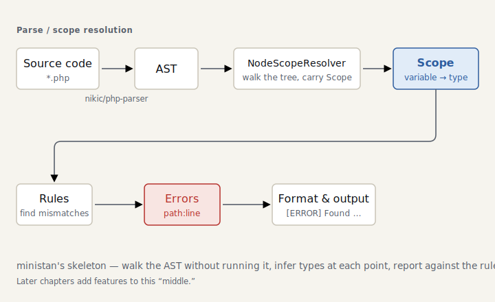

# Part 0 — The big picture and Hello World

> *The code for this chapter lives in the snapshot [`impls/wonderland/00-hello`](../../../impls/wonderland/00-hello) — a slice of the live `dev/` tree taken at `git tag part-00`.*

> **Further reading** (optional): ministan’s *non-rejecting* stance — never flag working code — sits close to **gradual typing**, which gives up a measure of soundness on purpose to avoid false positives (Siek & Taha, 2006). It’s a live frontier; we’ll come back to it where it bites.

## What this tutorial builds

We’re going to build **ministan**, a small static analyzer distilled from the essence of
[PHPStan](https://github.com/phpstan/phpstan), from scratch. Here’s where we end up:

```console
$ ministan analyse src/
 src/Foo.php:42
   Parameter #1 $name of function greet() expects string, int given.

 [ERROR] Found 1 error
```

We won’t build it all at once. Just as chibivue “writes Vue.js starting from the one line
`Hello, World.`,” we begin by **reporting a single syntax error** and then, chapter by
chapter,

- track variables (Part 2),
- give them types (Part 3),
- infer those types (Part 4),
- narrow them (Part 5),
- reflect over classes (Part 6),
- read PHPDoc (Part 7),
- bundle leveled rules (Part 8),
- and finish it as a usable tool (Part 9)

— growing a working thing a little at a time.

## Anatomy of a static analyzer

PHPStan is enormous, but its skeleton is surprisingly plain. **Without running** the code, it
walks the AST, infers the **type** of each variable at each point, and **reports**
contradictions against a set of rules. That’s all.

PHP checks type declarations **at runtime**: call a function declared `function f(int $x)`
with a string, and you get a `TypeError` on that line. What a static analyzer does is find them **before** that — without
running the code, tracing the possible types of values on paper. Even on a path your tests
never exercise, it catches the `$user->nmae` typo or the swapped type **before you ship**.
That’s the worth of “without running it.”

<picture>
  <source media="(prefers-color-scheme: dark)" srcset="../figures/00-pipeline-dark.svg">
  
</picture>

ministan follows this structure from the very start. We have neither `Scope` nor `Rule` yet
in this chapter, but we run the **two ends** through first — input (parsing) and output
(formatting `Error`s). That way every later chapter can concentrate on **adding a feature in
the middle**.

## Design philosophy: non-rejecting

There is one philosophy worth promising before anything else:

> **Accept any code that isn’t a syntax error.** Collapse a type you can’t determine to
> `mixed`, and stay silent about what you can’t be sure of.

Whether a static analyzer is useful comes down to **how few false positives it produces**. An
analyzer that piles up “not sure, so I’ll flag it anyway” is one nobody uses. PHPStan’s
`mixed`, and its level system (the mechanism that tightens little by little from level 0), are
both expressions of this philosophy. When we implement levels in Part 8, this promise is what
pays off.

> `mixed` is the **top type** — “anything could be here” — a real element of the lattice, not
> a per-value escape hatch that turns checking off the way TypeScript’s `any` does. How
> permissive `mixed` is depends on the *level*, not on the type itself: low levels wave it
> through; high levels object even to `mixed` creeping in (Part 8). That is non-rejecting,
> made concrete: choosing, level by level, whether to wave “unknown” through or to object to it.

## Build: run the pipeline through

Part 0’s `Analyser` does just one thing: it validates the syntax and **translates
php-parser’s syntax errors into ministan diagnostics (`Error`)**.

```php
// src/Analyser/Analyser.php (excerpt)
$parser = (new ParserFactory())->createForNewestSupportedVersion();

try {
    $parser->parse($code);
} catch (ParserError $e) {
    return [new Error($e->getRawMessage(), $file, $e->getStartLine())];
}

return []; // If the syntax is valid, there is nothing to report in Part 0.
```

The value object that is our unit of reporting, `Error`, we’ll keep using through every
chapter:

```php
// src/Analyser/Error.php
final readonly class Error
{
    public function __construct(
        public string $message,
        public string $file,
        public int $line,
    ) {}
}
```

Making it immutable with `readonly` properties (PHP 8.1+) is also groundwork for designing
`Scope` as an **immutable object** in a later chapter. There is a reason PHPStan’s `Scope` is
immutable, and it becomes clear in Part 2.

## Run it

```console
$ cd dev && composer install && cd ..

$ dev/bin/ministan analyse examples/hello.php
[OK] No errors

$ dev/bin/ministan analyse examples/broken.php
 examples/broken.php:8
   Syntax error, unexpected '}', expecting ';'

 [ERROR] Found 1 error
```

The exit code is CI-ready too: `1` when there’s a problem, `0` when there isn’t.

## Summary

- A static analyzer’s skeleton is **parse → resolve scope → apply rules → report**.
- This chapter ran the two ends (parsing and reporting) through, and set up the vessels we’ll
  grow from here: `Analyser`, `Error`, `ErrorFormatter`.
- The philosophy is **non-rejecting**: stay silent about what you don’t know.

In the next chapter, Part 1, we step into the AST and introduce the first substantive rule —
a check based on a syntax pattern — along with the `Rule` interface.
