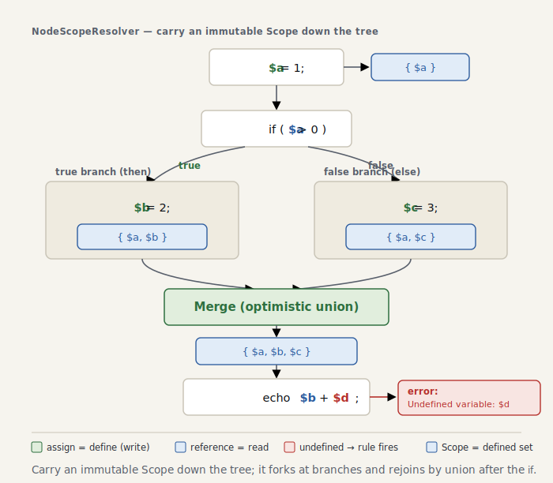

# Part 2 — Scope and tracking variables

> *The code for this chapter lives in the snapshot [`impls/wonderland/02-scope`](../../../impls/wonderland/02-scope) — a slice of the live `dev/` tree taken at `git tag part-02`.*

> **Further reading** (optional): TAPL chapters 9 and 11 develop the **typing context** (Γ) that threads through every typing rule. `Scope` is the same idea in code — a map from a variable to “what we know about it right here.” In Part 2 that knowledge is just “is it defined,” but once Part 3 puts types on it, `Scope` becomes a typing environment in the full sense.

Part 1’s rules looked only at the *shape* of the AST. This chapter brings in **context** for
the first time — a vessel that carries “what, exactly, do we know at this point?” That vessel
is **`Scope`**. Our subject is PHPStan’s level-0 headline act, **detecting undefined
variables**.

```php
function greet(string $name): string
{
    $greeting = 'Hello, ' . $name;

    return $greetnig; // typo → Undefined variable: $greetnig
}
```

## Why walking the AST isn’t enough

To say `$greetnig` is undefined, we have to know: *was `$greetnig` assigned anywhere on the
way to here?* That depends on **where in the tree we are** and **what happened on the path
that led there**. Part 1’s walk — looking at each node in isolation — cannot answer it, even
in principle.

So we carry a “set of defined variables” down the tree as we descend. That carrier is `Scope`.

## `Scope` is immutable

```php
// src/Analyser/Scope.php
final readonly class Scope
{
    /** @param array<string, true> $variables */
    private function __construct(private array $variables) {}

    public function hasVariable(string $name): bool
    {
        return isset($this->variables[$name]);
    }

    public function assignVariable(string $name): self
    {
        if (isset($this->variables[$name])) {
            return $this;
        }

        return new self([...$this->variables, $name => true]); // return a fresh Scope
    }
}
```

`assignVariable()` doesn’t mutate itself; it returns a **new `Scope`**. Why immutable? Because
of branches. A fact established in an `if`’s then-branch belongs to the then-branch alone.
Share one mutable object and the then-branch’s assignment leaks into the else-branch. With
immutability, each branch holds its own `Scope`, and at the join we can combine them exactly
as we intend. Making `Error` `readonly` back in Part 0 was groundwork for this same design.

> Reference note: TAPL writes the typing context as Γ and *extends* it — never mutates it —
> when a binding enters scope, as in the rule for `let`: the body is checked under Γ, x : T₁.
> An immutable `Scope` (where `assignVariable` returns a new `Scope`) is the runtime form of
> that same discipline — each branch can safely hold its own environment (the types ride in
> at Part 3).

> Part 2’s `Scope` holds only “defined or not.” In Part 3 each variable gets bound to a
> **type**, and `hasVariable()` grows up into `getType()`.

## From larva to adult — `NodeScopeResolver`

We retire Part 1’s `RuleApplyingVisitor` (which only visited nodes) and replace it with a
**recursive descent** that propagates scope
([`NodeScopeResolver`](../../../impls/wonderland/02-scope/src/Analyser/NodeScopeResolver.php)).
This corresponds to PHPStan’s `NodeScopeResolver`, and it is the backbone of the whole series.

The crux of the design is exactly one thing — **telling a read context from a write context**.

```php
private function processNode(Node $node, Scope $scope): Scope
{
    $this->applyRules($node, $scope); // apply rules with the scope at this point

    return match (true) {
        // handle only the constructs that bind variables, each on its own
        $node instanceof Expr\Assign     => $this->processAssign($node, $scope),
        $node instanceof Stmt\Foreach_   => $this->processForeach($node, $scope),
        // …function boundaries, catch, global, static…

        // everything else: descend into children mechanically, propagating scope in order
        default => $this->processChildren($node, $scope),
    };
}
```

In `$x = 1`, the left-hand `$x` is a **definition**, not a target for the undefined check. So
assignment gets its own handler: we analyze the right-hand side (a read) first, then bind the
left-hand side.

```php
private function processAssign(Expr\Assign $node, Scope $scope): Scope
{
    $scope = $this->processNode($node->expr, $scope);   // RHS variables are reads → checked
    return $this->processAssignTarget($node->var, $scope); // LHS is a definition → add to scope
}
```

The `$k`/`$v` of `foreach (... as $k => $v)`, function parameters, `catch (E $e)`,
`global $g`, `static $s`, destructuring `[$a, $b] = …` — **the places a variable is born** —
are the only cases we handle individually. After that, `processChildren()` simply descends.
Any `Variable` it meets down there is a read, so it goes through the rules. (To walk the
children we use php-parser’s `Node::getSubNodeNames()` — the list of child-node names each
node carries — which lets us descend mechanically without knowing the node’s kind.)

<picture>
  <source media="(prefers-color-scheme: dark)" srcset="../figures/02-scope-flow-dark.svg">
  
</picture>

## Rules know nothing about the walk

Undefined detection is a naive rule with no context of its own
([`UndefinedVariableRule`](../../../impls/wonderland/02-scope/src/Rules/Variables/UndefinedVariableRule.php)):

```php
public function processNode(Node $node, Scope $scope): array
{
    assert($node instanceof Variable);
    if (!is_string($node->name) || $scope->hasVariable($node->name)) {
        return []; // don't chase variable variables $$x / already defined → fine
    }
    return [new RuleError(sprintf('Undefined variable: $%s', $node->name), $node->getStartLine())];
}
```

The hard calls — “read or write?”, “inside an `isset()`?” — live **entirely on the Resolver’s
side**. The rule only ever receives a `Variable` at a “read point worth reporting.” This
**separation of concerns** is the source of PHPStan’s strength: you can pile on rules without
the thing falling apart.

## Holding the line on non-rejecting

A naive undefined check is a goldmine of false positives. ministan stays silent wherever it
can’t be sure.

- **Superglobals** (`$_GET`, …) are seeded as defined from the start.
- Inside **`isset($x)` / `empty($x)` / `$x ?? d`** we don’t run the undefined check (an
  undefined variable there is perfectly legal).
- **Joins are an optimistic union**
  ([`Scope::mergeWith()`](../../../impls/wonderland/02-scope/src/Analyser/Scope.php)). A
  variable counts as defined if it was defined on *any* path:

  ```php
  public function mergeWith(self $other): self
  {
      return new self($this->variables + $other->variables);
  }
  ```

  PHPStan does the opposite: it treats a variable as settled only when defined on **every**
  path, and otherwise reports it as *possibly undefined*. ministan **deliberately declines**
  that “possibly,” and lets it through with the optimistic union — a non-rejecting choice that
  puts zero false positives first, and one we don’t revisit in later chapters. It’s a separate
  matter from the *type* narrowing we add in Part 5: the “is this variable defined” verdict
  stays optimistic.

> Known shortfall: cases where the guard takes effect through an **expression** — like
> `isset($y) ? $y : 1` — are left to Part 5 (type narrowing) to refine.

## Run it, and turn it on itself

```console
$ dev/bin/ministan analyse dev/tests/fixtures/undefined-variable.php
 .../undefined-variable.php:9
   Undefined variable: $greetnig

 [ERROR] Found 1 error
```

A good static analyzer should be able to **pass its own source**. Turn ministan on ministan’s
own code and every file — closures, arrow functions, `match`, destructuring and all — passes
clean at this point, with no false positives (the more the analyzer grows, the more it tends
to set itself new homework — Part 8):

```console
$ for f in $(find dev/src -name '*.php'); do dev/bin/ministan analyse "$f"; done
# all [OK] No errors
```

## Summary

- `Scope` is an **immutable** object carrying “what we know at this point.”
- `NodeScopeResolver` propagates scope as it descends the tree — the key is **telling a read
  context from a write context**.
- Rules know nothing about the walk; they decide from the point and the `Scope` handed to
  them (separation of concerns).
- Joins use an optimistic union and so **emit no false positives**. Refinement is left to
  later chapters.

In the next chapter, Part 3, we widen what `Scope` holds from “defined or not” to **type**. We
introduce the `Type` interface (`accepts` / `isSuperTypeOf` / `describe`) and **constant
types** like `42` and `'foo'`, laying the foundation for type inference.
