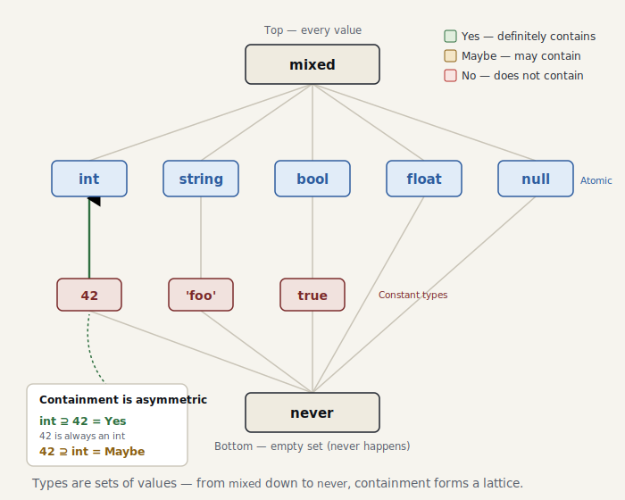

# Part 3 — The foundations of a type system

> *The code for this chapter lives in the snapshot [`impls/wonderland/03-type-system`](../../../impls/wonderland/03-type-system) — a slice of the live `dev/` tree taken at `git tag part-03`.*

> **Further reading** (optional): TAPL chapter 15, “Subtyping” — `mixed` / `never` as the top and bottom types is §15.4. The move is to read a type as a **set of values** and to ask about containment with `isSuperTypeOf` / `accepts`; that containment relation is exactly the subtype relation.

Part 2’s `Scope` knew only one thing about a variable: whether it was defined. Before we
grow that into a **type**, we first need the vocabulary to name types at all. This chapter
wires nothing up to a rule — it is pure **type algebra**, built up piece by piece, with unit
tests confirming each relation as we go.

## A type is a “set of values”

Read a type as a *set of values* and everything falls into place.

- `int` — the set of all integers
- `42` — the set containing the single value `42` (a **constant type**)
- `mixed` — the set of all values (the top)
- `never` — the empty set (the bottom; what can never happen)

Now the relationship between two types is just set containment: `42 ⊆ int ⊆ mixed`. Asking
about that containment is what `isSuperTypeOf()` does.

<picture>
  <source media="(prefers-color-scheme: dark)" srcset="../figures/03-type-lattice-dark.svg">
  
</picture>

## Three-valued logic — making “maybe” a first-class citizen

Yes/No isn’t enough to answer a containment question. Ask “is a value typed `mixed` also an
`int`?” and neither Yes nor No can answer — what’s actually inside that `mixed` isn’t known
until runtime. The answer has to be a third thing: Maybe. The thing that
expresses this “maybe” is
[`TrinaryLogic`](../../../impls/wonderland/03-type-system/src/TrinaryLogic.php) (corresponding
to PHPStan’s `TrinaryLogic`):

```php
enum TrinaryLogic
{
    case Yes;
    case Maybe;
    case No;
    // and / or / negate …
}
```

Why insist on a single enum? Because **the level system rides on this axis**. At low levels we
report only `No` (a definite violation) and let `Maybe` slip past; the higher the level, the
more we object to `Maybe` as well. The non-rejecting philosophy itself is expressed in these
three values (we cash it in at Part 8).

> **Reference note:** TAPL chapter 15 answers a subtyping question with the **two values**
> `true` / `false` — the relation `S <: T` either holds or it doesn’t. ministan adds a third
> answer to the same question: **`Maybe`**. That one move is the foundation of the level system
> (Part 8) — silent at low levels, objecting at high ones — and of the non-rejecting stance.
> “Don’t know” is the native condition of a dynamic language, so it had better be sayable.

## The `Type` interface

If rules are PHPStan’s heart, the core of the type system is
[`Type`](../../../impls/wonderland/03-type-system/src/Type/Type.php). It answers three
questions:

```php
interface Type
{
    public function describe(): string;                  // 'int', '42', 'mixed' …
    public function isSuperTypeOf(Type $type): TrinaryLogic; // the subtype relation
    public function accepts(Type $type): TrinaryLogic;       // assignability
    public function equals(Type $type): bool;
}
```

`isSuperTypeOf` (am I a superset of the other?) and `accepts` (can a value of the other type be
used where mine is expected? — assignability) are subtly different questions, but for simple
value types they coincide. So we factor
the shared work into
[`SimpleTypeTrait`](../../../impls/wonderland/03-type-system/src/Type/SimpleTypeTrait.php) and
let `accepts` delegate to `isSuperTypeOf`. The relation to the top (`mixed`) and the bottom
(`never`) is shared too, so it lives in the trait’s `relateToTopAndBottom()`:

```php
protected static function relateToTopAndBottom(Type $type): ?TrinaryLogic
{
    if ($type instanceof NeverType) return TrinaryLogic::Yes;  // never is a subtype of every type
    if ($type instanceof MixedType) return TrinaryLogic::Maybe; // mixed might be this type
    return null; // otherwise, fall through to each type's own decision
}
```

Thanks to that, the body of `int` is just this:

```php
public function isSuperTypeOf(Type $type): TrinaryLogic
{
    return self::relateToTopAndBottom($type)
        ?? (($type instanceof self || $type instanceof ConstantIntegerType)
            ? TrinaryLogic::Yes
            : TrinaryLogic::No);
}
```

## Constant types are where the precision comes from

Right after `$x = 42;`, is the type of `$x` `int`? No — it’s **`42`**. That distinction is what
decides how sharp the analysis can be. Because a value can carry the type `42`, we can reason
about `match` exhaustiveness and unreachable branches.

The relations on
[`ConstantIntegerType`](../../../impls/wonderland/03-type-system/src/Type/Constant/ConstantIntegerType.php)
follow the set intuition exactly:

```php
match (true) {
    $type instanceof self        => $this->value === $type->value ? Yes : No, // 42 ⊇ 42, 42 ⊉ 43
    $type instanceof IntegerType => TrinaryLogic::Maybe, // a general int just might be 42
    default                      => TrinaryLogic::No,
};
```

`int ⊇ 42` is Yes (`42` is always an `int`). The other way around, `42 ⊇ int` is Maybe (an
`int` *might* happen to be `42`, but it needn’t be). That asymmetry is what captures the
direction of the relation correctly.

## Pinning the relations down with tests

Since this chapter wires nothing up to a rule, the verification is a unit test of the type
algebra
([`TypeTest`](../../../impls/wonderland/03-type-system/tests/Type/TypeTest.php)). We lay out
the truth table of containment plainly:

```php
yield 'int ⊇ 42'    => [$int, new ConstantIntegerType(42), TrinaryLogic::Yes];
yield 'int ⊉ string'=> [$int, $string,                     TrinaryLogic::No];
yield 'int ⊇? mixed'=> [$int, $mixed,                      TrinaryLogic::Maybe];
yield '42 ⊇? int'   => [new ConstantIntegerType(42), $int, TrinaryLogic::Maybe];
yield 'never ⊉ mixed' => [$never, $mixed,                  TrinaryLogic::No];
```

## Summary

- A type is a **set of values**. Ask about containment with `isSuperTypeOf()` and about
  assignability with `accepts()`.
- The answer is three-valued (`TrinaryLogic`). **Making “maybe” a first-class citizen** is the
  foundation of the level system.
- `mixed` (the top — where the unknown collapses to) and `never` (the bottom) are the two ends
  of the type lattice.
- **Constant types** (`42`, `'foo'`, `true`) are where the analysis gets its precision.

In the next chapter, Part 4, this vocabulary finally meets `Scope`. We implement
`Scope::getType(Expr): Type` and **infer** the type of an expression from its literals and
binary operations — then add the `ministan annotate` command to show off the inferred result.
