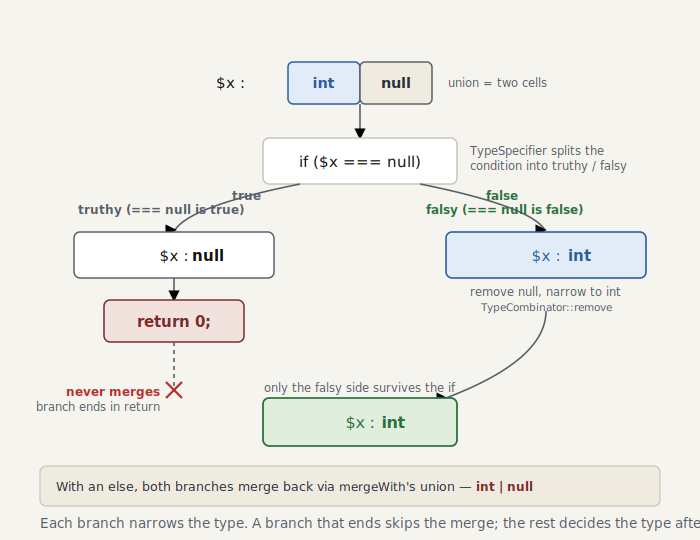

# Part 5 — Unions and type narrowing

> *The code for this chapter lives in the snapshot [`impls/wonderland/05-narrowing`](../../../impls/wonderland/05-narrowing) — a slice of the live `dev/` tree taken at `git tag part-05`.*

> **Further reading** (optional): **union types** without tags are terrain the textbooks step around — TAPL only ever gives you the *tagged* variants of §11.10. And **narrowing** (occurrence / flow typing) sits outside the standard texts entirely: it’s the particular ground a checker for a *dynamic* language has to walk.

In Part 4 we learned to infer the type of an expression. But real code branches on conditions.

```php
function f(int|null $x): int
{
    if ($x === null) {
        return 0;
    }
    return $x + 1; // here $x must be int
}
```

`$x` is `int|null`. But once we’re past `if ($x === null) return;`, it should have **narrowed**
to `int`. Making that happen is the work of this chapter: **type narrowing**, and the vessel
it merges into — the **`UnionType`**.

## First, the union type — `UnionType`

We need a **union type** (`int\|string`, “one of these”) to stand for “int or string”
([`UnionType`](../../../impls/wonderland/05-narrowing/src/Type/UnionType.php)). The subtype
check is straightforward: when the operand is a single type, it’s enough that **any one member
accepts it (OR)**:

```php
// For a single type, it suffices that any one member accepts it (OR).
$result = TrinaryLogic::No;
foreach ($this->types as $member) {
    $result = $result->or($member->isSuperTypeOf($type));
}
return $result; // int|string ⊇ 42 is Yes (int accepts it)
```

**Building** a union isn’t the type class’s job — it belongs to
[`TypeCombinator`](../../../impls/wonderland/05-narrowing/src/Type/TypeCombinator.php).
Normalization — flattening, dropping `never`, absorbing `mixed`, deduping, and collapsing to a
single type when there’s only one member — is a cross-cutting operation, and no individual type
should have to carry it:

```php
TypeCombinator::union(new IntegerType(), new StringType());           // int|string
TypeCombinator::union($intOrString, new NullType(), new NeverType()); // int|null|string
TypeCombinator::union(new IntegerType(), new MixedType());            // mixed (absorbed)
```

The inverse, `remove()`, is the key to the else branch. Subtract `null` from `int|null` and you
get `int`:

```php
TypeCombinator::remove($intOrNull, new NullType()); // int
```

## The narrowing engine — `TypeSpecifier`

[`TypeSpecifier`](../../../impls/wonderland/05-narrowing/src/Analyser/TypeSpecifier.php)
takes a condition and returns the scope for each side — the world where it held, and the world where it didn’t
(the counterpart to PHPStan’s class of the same name). Its result is a
[`SpecifiedTypes`](../../../impls/wonderland/05-narrowing/src/Analyser/SpecifiedTypes.php) — a
truthy / falsy pair.

```php
public function specify(Expr $condition, Scope $scope): SpecifiedTypes
{
    return match (true) {
        $condition instanceof Expr\BooleanNot       => $this->specify($condition->expr, $scope)->negate(),
        $condition instanceof Expr\Instanceof_       => $this->specifyInstanceof($condition, $scope),
        $condition instanceof Expr\FuncCall          => $this->specifyTypePredicate($condition, $scope),
        $condition instanceof Expr\Isset_            => $this->specifyIsset($condition, $scope),
        $condition instanceof Expr\BinaryOp\Identical => $this->specifyEquality($condition->left, $condition->right, $scope),
        // …NotIdentical negates, && and || compose…
        default => new SpecifiedTypes($scope, $scope), // a condition we don't understand narrows nothing
    };
}
```

A type predicate such as `is_int($x)` narrows both branches symmetrically:

```php
$truthy = $scope->assignVariable($name, $narrowed);                                  // true: int
$falsy  = $scope->assignVariable($name, TypeCombinator::remove($current, $narrowed)); // false: original − int
```

`!` is a one-liner — `negate()` swaps true for false — and `&&` / `||` simply compose the
`specify` of their two sides. Small parts, combined, cover complex conditions.

> **Reference note**: narrowing a type along the *shape* of a condition is, in type theory, a
> research area called **occurrence typing** (flow-dependent typing). The standard texts assign
> each expression a single static type once; “the same variable carries different types in
> different places” is terrain they leave unmapped — the particular ground a checker for a
> dynamic language has to cover.

> The truthy side of `instanceof` narrows to `ObjectType('Foo')`. But today’s `ObjectType` knows
> only a class name; it can’t do the strict check that accounts for inheritance. The subtraction
> on the else side needs inheritance information too, so it waits. We complete both when **Part 6
> strengthens `ObjectType`** with the reflection it gains there. Because we’re non-rejecting,
> for now we simply leave un-narrowed the part we can’t resolve.

<picture>
  <source media="(prefers-color-scheme: dark)" srcset="../figures/05-narrowing-dark.svg">
  
</picture>

## Weaving it into the branches

We make `NodeScopeResolver` treat `if` specially, threading the condition’s narrowing into each
branch
([`processIf`](../../../impls/wonderland/05-narrowing/src/Analyser/NodeScopeResolver.php)):

```php
$specified = $this->typeSpecifier->specify($node->cond, $scope);
$endScopes[] = $this->processStmts($node->stmts, $specified->truthy); // then runs with truthy

$falsy = $specified->falsy;
foreach ($node->elseifs as $elseif) { /* walk the elseifs carrying falsy */ }
$endScopes[] = $node->else !== null
    ? $this->processStmts($node->else->stmts, $falsy)
    : $falsy;                                  // no else = the path where every condition was false

// merge each branch's end scope with a union
$result = array_shift($endScopes);
foreach ($endScopes as $branch) { $result = $result->mergeWith($branch); }
```

And we refine `Scope::mergeWith()` from Part 4’s “collapse to `mixed` on disagreement” into a
**proper union merge**:

```php
$merged[$name] = isset($merged[$name])
    ? TypeCombinator::union($merged[$name], $type) // int in then, string in else → int|string
    : $type;
```

## Collecting the debt

In Part 2 we deferred “the `isset($y) ? $y : 1` miss” to Part 5. Handling the ternary so that it,
too, uses narrowing clears it
([`processTernary`](../../../impls/wonderland/05-narrowing/src/Analyser/NodeScopeResolver.php)):

```php
$specified = $this->typeSpecifier->specify($node->cond, $scope);
if ($node->if !== null) {
    $this->processNode($node->if, $specified->truthy); // isset($y) true → $y is defined
}
$this->processNode($node->else, $specified->falsy);
```

```console
$ dev/bin/ministan analyse dev/tests/fixtures/isset-ternary.php
[OK] No errors
```

`$name` is never assigned, yet we correctly judge `isset($name) ? $name : 'anon'` to be safe.
Part 2 would have raised a false positive right here.

## Summary

- `UnionType` stands for “one of these types”; building and normalizing it is concentrated in
  `TypeCombinator`.
- `TypeSpecifier` derives the truthy / falsy narrowing from a condition. `!` / `&&` / `||` are
  handled by composition.
- We make `if` and the ternary special cases, threading the narrowing into each branch and
  merging them back with `mergeWith`’s union.
- We collected the isset-ternary debt left over from Part 2.
- The real work on `instanceof` waits for Part 6, where `ObjectType` learns about inheritance.

In the next chapter, Part 6, we introduce **reflection**. We read the signatures of classes,
methods, and functions, strengthen `ObjectType` so it accounts for inheritance, and move on to
inferring the return types of method calls — and to detecting access to undefined methods and
properties.
