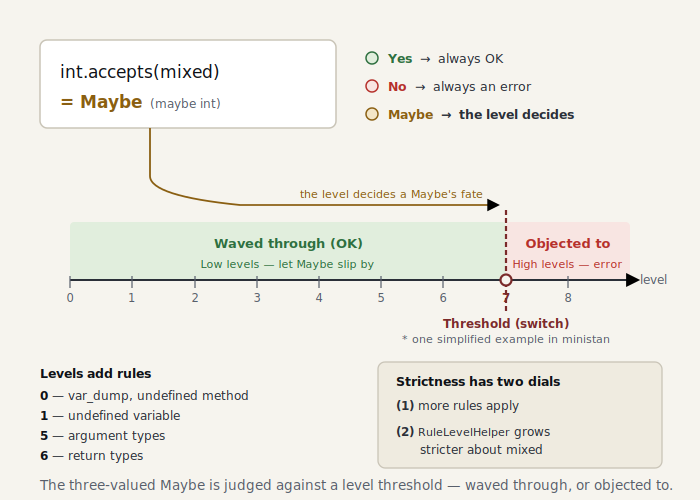

# Part 8 — Rules and levels

> *The code for this chapter lives in the snapshot [`impls/wonderland/08-rules-and-levels`](../../../impls/wonderland/08-rules-and-levels) — a slice of the live `dev/` tree taken at `git tag part-08`.*

> **Further reading** (optional): TAPL chapter 15 builds **subtyping** as a relation that either holds or doesn’t — a *binary* verdict. This chapter adds a third answer, **Maybe** (`TrinaryLogic`), and then makes the level decide what to do with it. A sound type system, by design, will reject some programs that would have run fine; ministan’s level system is how we tame that trade-off instead of paying for it everywhere at once.

By now we can infer types. It’s time to put types to **use** in rules — catching type
mismatches in arguments and return values — and to implement what PHPStan is really known for:
the **level system**.

## What a level really is — `RuleLevelHelper`

“May I pass a `mixed` where an `int` is expected?” The answer is Part 3’s third value: `int`
accepts `mixed` with a **Maybe** (it might be an int). What we do with that Maybe is **what a
level really is** ([`RuleLevelHelper`](../../../impls/wonderland/08-rules-and-levels/src/Rules/RuleLevelHelper.php)):

```php
public function isAcceptable(Type $accepting, Type $accepted): bool
{
    return match ($accepting->accepts($accepted)) {
        TrinaryLogic::Yes   => true,                       // certainly fits
        TrinaryLogic::No    => false,                      // certainly doesn't → always object
        TrinaryLogic::Maybe => $this->level < self::STRICT_LEVEL, // object only at high levels
    };
}
```

At low levels we wave `mixed` through; at high levels (ministan sets the threshold at 7) we
object even to `mixed` creeping in. The groundwork we laid in Part 3 — “make `TrinaryLogic` a
first-class citizen” — is exactly what pays off here.

> This “7” is one simplified threshold for ministan’s minimal core. Real PHPStan doesn’t use a
> single number: it tightens in stages — explicit `mixed` at level 9, unions at level 7,
> nullables at level 8, and so on.

<picture>
  <source media="(prefers-color-scheme: dark)" srcset="../figures/08-levels-dark.svg">
  
</picture>

> Reference note: this is exactly the non-rejecting promise from Part 0, made mechanical. That
> trade-off — see the note above — is exactly what levels make adjustable, and
> gradual typing (Siek & Taha, 2006) buys it back by letting the unknown pass. ministan goes
> one step further and puts “**don’t know = Maybe = stay silent**” (never object to a `Maybe`
> until the high levels) at the center of the machine, so false positives are hard to produce
> in the first place. There is no clean English textbook for this particular move; the closest
> anchor is the gradual-typing literature above.

## Rules that use types

Argument matching is identical for functions and methods, so we factor it out into
[`ArgumentTypeChecker`](../../../impls/wonderland/08-rules-and-levels/src/Rules/ArgumentTypeChecker.php).
It infers each actual argument and holds it against the corresponding parameter type with
`isAcceptable()` — nothing more:

```php
$expected = $parameterTypes[$position];
$actual = $scope->getType($arg->value);
if (!$this->ruleLevelHelper->isAcceptable($expected, $actual)) {
    $mismatches[] = [$position + 1, $expected, $actual];
}
```

The rules that use it are
[`FunctionCallParameterTypesRule`](../../../impls/wonderland/08-rules-and-levels/src/Rules/Functions/FunctionCallParameterTypesRule.php) and
[`MethodCallParameterTypesRule`](../../../impls/wonderland/08-rules-and-levels/src/Rules/Methods/MethodCallParameterTypesRule.php),
plus [`FunctionReturnTypeRule`](../../../impls/wonderland/08-rules-and-levels/src/Rules/Functions/FunctionReturnTypeRule.php),
which looks at the return value. The return check needs to know “the declared return type of
the function we’re currently inside,” so we made `Scope` carry it (set with
`withFunctionReturnType()` on entering a function body).

## Narrowing for `&&` and `||` too

The moment we added the argument check and turned it on ministan itself, this false positive
surfaced:

```php
if ($docComment === null || trim($docComment) === '') { /* … */ }
//                          ^^^^ trim() expects string, string|null given
```

At runtime the `||` short-circuits and it’s perfectly safe, but the analyzer wasn’t
**narrowing** `$docComment` to non-null on the right-hand side. So we flow Part 5’s narrowing
into the right operand of `&&` and `||` as well
([`processLogical`](../../../impls/wonderland/08-rules-and-levels/src/Analyser/NodeScopeResolver.php)):

```php
$specified = $this->typeSpecifier->specify($node->left, $scope);
// && evaluates the right side in the world where the left is true; || where it's false
$rightScope = $node instanceof Expr\BinaryOp\BooleanAnd ? $specified->truthy : $specified->falsy;
$this->processNode($node->right, $rightScope);
```

> **Some holes only show up once you turn the analyzer on itself** — which is exactly why a
> good analyzer should be able to pass its own source.

## Bundling rules by level

We keep a table that tags each rule with its **minimum level**, and collect everything at or
below the requested level
([`RuleRegistryFactory`](../../../impls/wonderland/08-rules-and-levels/src/Rules/RuleRegistryFactory.php)):

```php
$leveled = [
    [0, new NoVarDumpRule()],
    [0, new CallToUndefinedMethodRule()],
    [0, new UndefinedVariableRule()],
    [5, new FunctionCallParameterTypesRule($checker)],
    [5, new MethodCallParameterTypesRule($checker)],
    [6, new FunctionReturnTypeRule($helper)],
];
```

Strictness grows on **two dials at once** — the higher the level, (1) the more rules apply,
and (2) the stricter `RuleLevelHelper` gets about `mixed`.

> The level numbers are a simplification for the minimal core. The undefined-method check, for
> instance, is split in real PHPStan — `$this->` only at level 0, **any expression** at level 2
> — whereas ministan looks at every expression from level 0 with a single rule (what it
> catches is the same).

## Run it

```console
$ dev/bin/ministan analyse --level=0 examples/level.php
[OK] No errors

$ dev/bin/ministan analyse --level=5 examples/level.php
 examples/level.php:10
   Parameter #1 of function needs_int() expects int, 'hello' given.

$ dev/bin/ministan analyse --level=6 examples/level.php
 …
   Should return string but returns 42.
```

The same code starts to say more, the higher the level. Turn ministan on its own source and,
at the default level 5, every file passes; at level 9 the places that “pass a `mixed`” rise to
the surface — which is precisely the work of stamping out `mixed` in PHPStan.

## Summary

- `RuleLevelHelper` is what “objects to a Maybe according to the level” — that is what a level
  really is.
- We detect argument and return-value type mismatches by holding the inferred type against the
  declared one with `isAcceptable()`.
- We flowed narrowing into the right operand of `&&` and `||`, clearing a false positive
  (found by analyzing ourselves).
- We bundle rules with a minimum level and raise strictness on two dials at once.

In the next chapter, Part 9 (the last of the basics volume), we finish this into a real tool:
directory recursion, multiple output formats, baseline — the last step to something usable.
