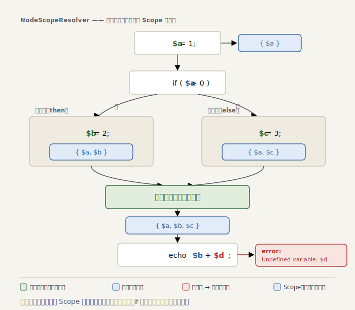

# Part 2 — Scope と変数追跡

> ＊この章のコードはスナップショット [`impls/02-scope`](../../impls/02-scope) にあります（この章の到達点は `git tag part-02`）。

> 参考書（任意）：『しくみ』3・4 章の **型環境（tyenv）**／TAPL 9・11 章。`Scope` は「変数 → そこで分かっていること」の対応で、Part 3 で型が乗ると型理論の型環境そのものになります。

Part 1 のルールは AST の形だけを見ていました。本章で初めて **文脈** が登場します。
「この地点で、いったい何が分かっているのか？」を運ぶ器 —— **`Scope`** です。
題材は、PHPStan level 0 の看板である **未定義変数の検出** です。

```php
function greet(string $name): string
{
    $greeting = 'Hello, ' . $name;

    return $greetnig; // タイポ → Undefined variable: $greetnig
}
```

## なぜ AST 走査だけでは足りないのか

`$greetnig` が未定義だと言うには、「ここに来るまでに `$greetnig` は代入されたか？」を
知らねばなりません。これは **木のどこにいるか** と **そこに至る経路で何が起きたか** に
依存します。Part 1 の「ノードを独立に見る」走査では原理的に答えられない。

そこで、木を下りながら「定義済み変数の集合」を持ち回ります。それが `Scope` です。

## `Scope` は不変

```php
// src/Analyser/Scope.php
final readonly class Scope
{
    /** @param array<string, true> $variables */
    private function __construct(private array $variables) {}

    public function hasVariable(string $name): bool
    {
        return isset($this->variables[$name]);
    }

    public function assignVariable(string $name): self
    {
        if (isset($this->variables[$name])) {
            return $this;
        }

        return new self([...$this->variables, $name => true]); // 新しい Scope を返す
    }
}
```

`assignVariable()` は自分を書き換えず、**新しい `Scope`** を返します。なぜ不変か ——
分岐があるからです。`if` の then 節で得た事実は then 節だけのもの。可変オブジェクトを
共有すると、then の代入が else にまで漏れてしまう。不変なら、枝ごとに別の `Scope` を
持たせ、合流時に意図どおり混ぜられます。Part 0 で `Error` を `readonly` にしたのも、
この設計に揃えるための地ならしでした。

> 参考書メモ：『しくみ』3・4 章は型環境を `tyEnv` と呼び、束縛を足すとき破壊せず
> `{ ...tyEnv, x: 型 }` と**コピー**して引き回しました。不変 `Scope`（`assignVariable` が新しい
> `Scope` を返す）はそれと同じ作法です —— 枝ごとに別の環境を安全に持てるのが狙い（型が乗るのは Part 3）。

> Part 2 の `Scope` は「定義済みか否か」だけを持ちます。Part 3 で各変数に**型**が
> 結びつき、`hasVariable()` は `getType()` へと育ちます。

## 幼生から成体へ —— `NodeScopeResolver`

Part 1 の `RuleApplyingVisitor`（ただノードを訪れるだけ）を捨て、スコープを伝播させる
**再帰下降**に置き換えます（[`NodeScopeResolver`](../../impls/02-scope/src/Analyser/NodeScopeResolver.php)）。
これは PHPStan の `NodeScopeResolver` に対応する、本シリーズの背骨です。

設計の核心はただ一つ —— **読み取り文脈と書き込み文脈を区別する**こと。

```php
private function processNode(Node $node, Scope $scope): Scope
{
    $this->applyRules($node, $scope); // この地点のスコープでルールを適用

    return match (true) {
        // 変数を束縛する構文だけを個別に捌く
        $node instanceof Expr\Assign     => $this->processAssign($node, $scope),
        $node instanceof Stmt\Foreach_   => $this->processForeach($node, $scope),
        // …関数境界・catch・global・static…

        // それ以外は機械的に子へ降り、スコープを順に伝播
        default => $this->processChildren($node, $scope),
    };
}
```

`$x = 1` の左辺 `$x` は **定義** であって、未定義チェックの対象ではありません。
だから代入は専用処理にし、右辺（読み取り）を先に解析してから左辺を束縛します:

```php
private function processAssign(Expr\Assign $node, Scope $scope): Scope
{
    $scope = $this->processNode($node->expr, $scope);   // 右辺の変数は読み取り → チェック対象
    return $this->processAssignTarget($node->var, $scope); // 左辺は定義 → スコープに加える
}
```

`foreach (... as $k => $v)` の `$k`/`$v`、関数パラメータ、`catch (E $e)`、`global $g`、
`static $s`、分割代入 `[$a, $b] = …` —— **変数が生まれる場所** はこれだけ個別に捌けば、
あとは `processChildren()` が子へ降りるだけ。降りた先で出会う `Variable` は読み取りなので、
ルールに掛かります（子の辿り方は php-parser の `Node::getSubNodeNames()` —— 各ノードが
持つ子の名前一覧 —— を使えば、ノード種別を知らずに機械的に降りられます）。

<picture>
  <source media="(prefers-color-scheme: dark)" srcset="figures/02-scope-flow-dark.svg">
  
</picture>

## ルールは走査を知らない

未定義検出は、文脈を一切持たない素朴なルールです
（[`UndefinedVariableRule`](../../impls/02-scope/src/Rules/Variables/UndefinedVariableRule.php)）:

```php
public function processNode(Node $node, Scope $scope): array
{
    assert($node instanceof Variable);
    if (!is_string($node->name) || $scope->hasVariable($node->name)) {
        return []; // 可変変数 $$x は追わない／定義済みなら問題なし
    }
    return [new RuleError(sprintf('Undefined variable: $%s', $node->name), $node->getStartLine())];
}
```

「読み取りか書き込みか」「isset() の内側か」といった難しい判断は **すべて Resolver の側**。
ルールには「報告すべき読み取り地点」でのみ `Variable` が渡ってきます。この**関心の分離**が、
ルールを増やしても破綻しない PHPStan の強さの源です。

## non-rejecting を守る

素朴な未定義チェックは偽陽性の宝庫です。ministan は確信が持てない所では黙ります。

- **スーパーグローバル**（`$_GET` など）は最初から定義済みとして種をまく
- **`isset($x)` / `empty($x)` / `$x ?? d`** の内側は未定義チェックしない（未定義でも合法だから）
- **分岐の合流は楽観的な和集合**（[`Scope::mergeWith()`](../../impls/02-scope/src/Analyser/Scope.php)）。
  「どれかの経路で定義されていれば定義済み」とみなす:

  ```php
  public function mergeWith(self $other): self
  {
      return new self($this->variables + $other->variables);
  }
  ```

  PHPStan は逆に「**全**経路で定義された場合のみ確定」とし、そうでなければ「未定義かも
  しれない（possibly undefined）」と報告します。ministan はこの「かもしれない」を**あえて
  採らず**、楽観的和集合で通します —— 偽陽性ゼロを優先する non-rejecting の選択で、後の章でも
  変えません。Part 5 で入れる*型*の絞り込みとは別の話で、変数が「定義済みか」の判定はこの
  楽観のままです。

> 既知の積み残し: `isset($y) ? $y : 1` のように、ガードが**式**で効くケースの精密化は
> Part 5（型の絞り込み）に回します。

## 動かす・自分自身に当てる

```console
$ dev/bin/ministan analyse dev/tests/fixtures/undefined-variable.php
 .../undefined-variable.php:9
   Undefined variable: $greetnig

 [ERROR] Found 1 error
```

良い静的解析器は **自分自身を通せる**べきです。ministan を ministan 自身のソースに当てると、
クロージャ・アロー関数・`match`・分割代入を含む全ファイルが、この時点では偽陽性なしで通ります
（解析器が育つほど、自分自身が新たな宿題を出すこともあります —— Part 8）:

```console
$ for f in $(find dev/src -name '*.php'); do dev/bin/ministan analyse "$f"; done
# すべて [OK] No errors
```

## まとめ

- `Scope` は「その地点で分かっていること」を運ぶ **不変** オブジェクト
- `NodeScopeResolver` が木を下りながらスコープを伝播させる —— 鍵は
  **読み取り文脈と書き込み文脈の区別**
- ルールは走査を知らず、渡された地点と `Scope` だけで判断する（関心の分離）
- 合流は楽観的和集合で **偽陽性を出さない**。精密化は後の章へ

次の Part 3 では、`Scope` が持つ情報を「定義済みか否か」から **型** へと拡張します。
`Type` インターフェイス（`accepts` / `isSuperTypeOf` / `describe`）と、`42` や `'foo'`
といった **定数型** を導入し、型推論への土台を作ります。
