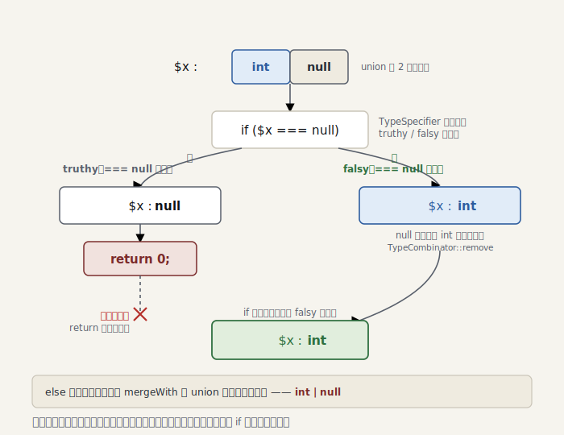

# Part 5 — Union と型の絞り込み

> ＊この章のコードはスナップショット [`impls/05-narrowing`](../../impls/05-narrowing) にあります（この章の到達点は `git tag part-05`）。

> 参考書（任意）：無タグの **合併型** は『しくみ』が*あえて避け*、TAPL も 11 章 §11.10 の*タグ付き*バリアントしか持たない領域。**絞り込み**（occurrence／flow typing）も両書の外 —— 動的言語の検査器ならではの地形です。

Part 4 で式の型を推論できるようになりました。でも実際のコードは条件で枝分かれします。

```php
function f(int|null $x): int
{
    if ($x === null) {
        return 0;
    }
    return $x + 1; // ここでは $x は int のはず
}
```

`$x` は `int|null`。でも `if ($x === null) return;` を抜けた後では `int` に**狭まって**
いるべきです。これを実現するのが本章の主役、**型の絞り込み（narrowing）** と、その器で
ある **`UnionType`** です。

## まず合併型 —— `UnionType`

「int または string」を表す型が要ります（[`UnionType`](../../impls/05-narrowing/src/Type/UnionType.php)）。
部分型判定は素直で、相手が単型なら **どれか 1 つのメンバが受ければよい（OR）**:

```php
$result = TrinaryLogic::No;
foreach ($this->types as $member) {
    $result = $result->or($member->isSuperTypeOf($type));
}
return $result; // int|string ⊇ 42 は Yes（int が受ける）
```

合併の **生成** は型クラスではなく [`TypeCombinator`](../../impls/05-narrowing/src/Type/TypeCombinator.php)
に集約します。正規化—フラット化・`never` 除去・`mixed` 吸収・重複除去・1 個なら単型—は
横断的な操作で、各型に持たせるべきではないからです:

```php
TypeCombinator::union(new IntegerType(), new StringType());          // int|string
TypeCombinator::union($intOrString, new NullType(), new NeverType()); // int|null|string
TypeCombinator::union(new IntegerType(), new MixedType());            // mixed（吸収）
```

逆操作 `remove()` が else 分岐の鍵です。`int|null` から `null` を引けば `int`:

```php
TypeCombinator::remove($intOrNull, new NullType()); // int
```

## 絞り込みエンジン —— `TypeSpecifier`

条件式を受け取り、「真だったとき」「偽だったとき」それぞれで成り立つスコープを返すのが
[`TypeSpecifier`](../../impls/05-narrowing/src/Analyser/TypeSpecifier.php)（PHPStan の同名クラスに対応）。
結果は [`SpecifiedTypes`](../../impls/05-narrowing/src/Analyser/SpecifiedTypes.php)（truthy/falsy の組）です。

```php
public function specify(Expr $condition, Scope $scope): SpecifiedTypes
{
    return match (true) {
        $condition instanceof Expr\BooleanNot       => $this->specify($condition->expr, $scope)->negate(),
        $condition instanceof Expr\Instanceof_       => $this->specifyInstanceof($condition, $scope),
        $condition instanceof Expr\FuncCall          => $this->specifyTypePredicate($condition, $scope),
        $condition instanceof Expr\Isset_            => $this->specifyIsset($condition, $scope),
        $condition instanceof Expr\BinaryOp\Identical => $this->specifyEquality($condition->left, $condition->right, $scope),
        // …NotIdentical は negate、&&・|| は合成…
        default => new SpecifiedTypes($scope, $scope), // 分からない条件は何も狭めない
    };
}
```

`is_int($x)` のような型述語は、両分岐を対称に狭めます:

```php
$truthy = $scope->assignVariable($name, $narrowed);                       // 真: int
$falsy  = $scope->assignVariable($name, TypeCombinator::remove($current, $narrowed)); // 偽: 元 − int
```

`!` は `negate()`（真偽の入れ替え）一行で済み、`&&`/`||` は左右の `specify` を合成する
だけ。小さな部品の組み合わせで複雑な条件に対応できます。

> 参考書メモ：条件のかたちに沿って型を狭めるこの操作は、型理論では **occurrence typing**
> （フロー依存型付け）と呼ばれる研究領域です。
> TAPL も『しくみ』も式に静的な型を一度つける枠組みで、「同じ変数が場所によって型を変える」この
> 地形は扱いません —— 動的言語を相手にする検査器ならではの領域です。

> `instanceof` の truthy は `ObjectType('Foo')` に狭めます。ただし今の `ObjectType` は
> クラス名しか知らず、継承を踏まえた厳密判定はできません。else 側の引き算も継承情報が
> 要るため見送り。これらは **リフレクションを得る Part 6 で `ObjectType` を強化**して
> 完成させます。non-rejecting なので、今は分からない分を狭めないだけです。

<picture>
  <source media="(prefers-color-scheme: dark)" srcset="figures/05-narrowing-dark.svg">
  
</picture>

## 分岐に織り込む

`NodeScopeResolver` の `if` を専用処理にし、条件の絞り込みを各枝へ流します
（[`processIf`](../../impls/05-narrowing/src/Analyser/NodeScopeResolver.php)）:

```php
$specified = $this->typeSpecifier->specify($node->cond, $scope);
$endScopes[] = $this->processStmts($node->stmts, $specified->truthy); // then は truthy で

$falsy = $specified->falsy;
foreach ($node->elseifs as $elseif) { /* falsy を運びながら elseif を辿る */ }
$endScopes[] = $node->else !== null
    ? $this->processStmts($node->else->stmts, $falsy)
    : $falsy;                                  // else 無し = 全条件が偽の経路

// 各枝の終端スコープを union で合流
$result = array_shift($endScopes);
foreach ($endScopes as $branch) { $result = $result->mergeWith($branch); }
```

そして `Scope::mergeWith()` を Part 4 の「食い違えば mixed」から、**正しい union 合流**へ
精密化しました:

```php
$merged[$name] = isset($merged[$name])
    ? TypeCombinator::union($merged[$name], $type) // then で int・else で string → int|string
    : $type;
```

## 積み残しの回収

Part 2 で「`isset($y) ? $y : 1` の取りこぼし」を Part 5 送りにしました。三項演算子も
絞り込みを使うよう処理したことで、これが解消されます
（[`processTernary`](../../impls/05-narrowing/src/Analyser/NodeScopeResolver.php)）:

```php
$specified = $this->typeSpecifier->specify($node->cond, $scope);
if ($node->if !== null) {
    $this->processNode($node->if, $specified->truthy); // isset($y) の真 → $y は定義済み
}
$this->processNode($node->else, $specified->falsy);
```

```console
$ dev/bin/ministan analyse dev/tests/fixtures/isset-ternary.php
[OK] No errors
```

`$name` は一度も代入されないのに、`isset($name) ? $name : 'anon'` は安全だと正しく
判断できました。Part 2 ならここで偽陽性を出していました。

## まとめ

- `UnionType` が「いずれかの型」を表し、生成と正規化は `TypeCombinator` に集約する
- `TypeSpecifier` が条件から truthy/falsy の絞り込みを導く。`!`/`&&`/`||` は合成で対応
- `if`/三項を専用処理にし、絞り込みを各枝へ流して `mergeWith` の union で合流する
- Part 2 の isset-三項の取りこぼしを回収した
- `instanceof` の本格化は、`ObjectType` を継承対応にする Part 6 へ

次の Part 6 では **リフレクション**を導入します。クラス・メソッド・関数のシグネチャを
読み取り、`ObjectType` を継承対応に強化し、メソッド呼び出しの戻り値型推論や、
未定義メソッド／プロパティアクセスの検出へ進みます。
