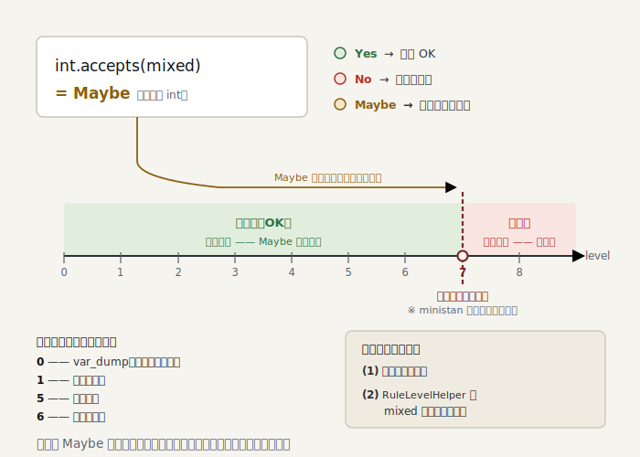

# Part 8 — ルールとレベル

> ＊この章のコードはスナップショット [`impls/08-rules-and-levels`](../../impls/08-rules-and-levels) にあります（この章の到達点は `git tag part-08`）。

> 参考書（任意）：『しくみ』7 章・TAPL 15 章の部分型判定（合う／合わないの **二値**）に、三つ目「**たぶん**（`Maybe`）」を足す章。「健全な型システムが*良いプログラムを弾く*」（『しくみ』7 章のコラム）を、レベルで飼いならします。

ここまでで型を推論できます。いよいよ型を**使う**ルール —— 引数や戻り値の型不一致の
検出 —— と、PHPStan の真骨頂 **レベル制** を実装します。

## レベルの正体 —— `RuleLevelHelper`

「`int` を期待する場所に `mixed` を渡してよいか？」の答えは Part 3 の三値です:
`int` は `mixed` を **Maybe**（たぶん int）で受けます。この Maybe をどう扱うかが
**レベルの正体**です（[`RuleLevelHelper`](../../impls/08-rules-and-levels/src/Rules/RuleLevelHelper.php)）:

```php
public function isAcceptable(Type $accepting, Type $accepted): bool
{
    return match ($accepting->accepts($accepted)) {
        TrinaryLogic::Yes   => true,                       // 確実に適合
        TrinaryLogic::No    => false,                      // 確実に不適合 → 常に咎める
        TrinaryLogic::Maybe => $this->level < self::STRICT_LEVEL, // 高レベルでのみ咎める
    };
}
```

低レベルでは `mixed` を素通りさせ、高レベル（ministan では閾値を 7 とした）では `mixed` の
混入も咎める。Part 3 で「`TrinaryLogic` を一級市民にする」と言った布石が、ここで回収されます。

> この「7」は ministan の簡略化した一つの閾値です。実 PHPStan は単一の数値ではなく、
> explicit な `mixed` は level 9、union は 7、nullable は 8 …と段階的に厳しくします。

<picture>
  <source media="(prefers-color-scheme: dark)" srcset="figures/08-levels-dark.svg">
  
</picture>

## 型を使うルール

引数の照合は関数とメソッドで共通なので
[`ArgumentTypeChecker`](../../impls/08-rules-and-levels/src/Rules/ArgumentTypeChecker.php) に括り出します。各実引数を
推論し、対応するパラメータ型に `isAcceptable()` で照らすだけ:

```php
$expected = $parameterTypes[$position];
$actual = $scope->getType($arg->value);
if (!$this->ruleLevelHelper->isAcceptable($expected, $actual)) {
    $mismatches[] = [$position + 1, $expected, $actual];
}
```

これを使うのが
[`FunctionCallParameterTypesRule`](../../impls/08-rules-and-levels/src/Rules/Functions/FunctionCallParameterTypesRule.php)・
[`MethodCallParameterTypesRule`](../../impls/08-rules-and-levels/src/Rules/Methods/MethodCallParameterTypesRule.php) と、
戻り値を見る
[`FunctionReturnTypeRule`](../../impls/08-rules-and-levels/src/Rules/Functions/FunctionReturnTypeRule.php) です。
戻り値検査は「現在いる関数の戻り値型」を必要とするので、`Scope` がそれを運ぶようにしました
（関数本体に入るとき `withFunctionReturnType()` で設定）。

## narrowing を `&&`／`||` にも

引数検査を入れて自分自身に当てたら、こんな誤検出が出ました:

```php
if ($docComment === null || trim($docComment) === '') { /* … */ }
//                          ^^^^ trim() expects string, string|null given
```

実行時は `||` の短絡で安全ですが、解析器が右辺で `$docComment` を非 null に
**絞り込めていません**でした。そこで Part 5 の絞り込みを `&&`／`||` の右辺にも流します
（[`processLogical`](../../impls/08-rules-and-levels/src/Analyser/NodeScopeResolver.php)）:

```php
$specified = $this->typeSpecifier->specify($node->left, $scope);
// && は「左が真」、|| は「左が偽」の世界線で右辺を評価する
$rightScope = $node instanceof Expr\BinaryOp\BooleanAnd ? $specified->truthy : $specified->falsy;
$this->processNode($node->right, $rightScope);
```

> **自分自身に当てて初めて分かる穴がある** —— 良い解析器が自分を通せるべき理由です。

## レベルでルールを束ねる

各ルールに「最低レベル」を添えた表を持ち、要求レベル以下を集めます
（[`RuleRegistryFactory`](../../impls/08-rules-and-levels/src/Rules/RuleRegistryFactory.php)）:

```php
$leveled = [
    [0, new NoVarDumpRule()],
    [0, new CallToUndefinedMethodRule()],
    [0, new UndefinedVariableRule()],
    [5, new FunctionCallParameterTypesRule($checker)],
    [5, new MethodCallParameterTypesRule($checker)],
    [6, new FunctionReturnTypeRule($helper)],
];
```

厳しさは **二段構え** で増します —— レベルを上げるほど (1) ルールが増え、(2)
`RuleLevelHelper` が `mixed` にも厳しくなる。

> レベル番号は最小核向けの素朴化です。たとえば未定義メソッドの検査は、実 PHPStan では
> `$this->` 限定が level 0・**全式**が level 2 と分かれますが、ministan は 1 つのルールで
> 全式を level 0 から見ます（検出内容は変わりません）。

## 動かす

```console
$ dev/bin/ministan analyse --level=0 examples/level.php
[OK] No errors

$ dev/bin/ministan analyse --level=5 examples/level.php
 examples/level.php:10
   Parameter #1 of function needs_int() expects int, 'hello' given.

$ dev/bin/ministan analyse --level=6 examples/level.php
 …
   Should return string but returns 42.
```

同じコードが、レベルを上げるほど多くを語り始めます。ministan を自分自身に当てると、
既定の level 5 では全ファイルが通り、level 9 では「`mixed` を渡している」箇所が
浮かび上がります —— PHPStan で `mixed` を潰していく作業そのものです。

## まとめ

- `RuleLevelHelper` が「Maybe をレベルに応じて咎める」 —— これがレベルの正体
- 引数・戻り値の型不一致を、推論した型と宣言型の `isAcceptable()` 照合で検出する
- 絞り込みを `&&`／`||` の右辺にも流し、誤検出を消した（自己解析で発見）
- ルールに最低レベルを添えて束ね、厳しさを二段構えで上げる

次の Part 9（基礎編の最終章）では、これをツールに仕上げます。ディレクトリ再帰、
複数フォーマット出力、baseline —— 実用の最後の一歩です。
