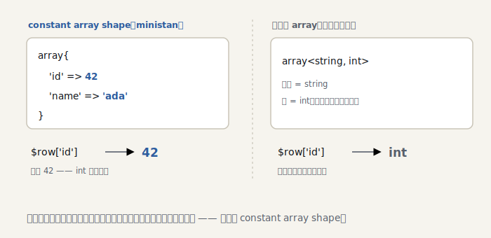

# The Seasoned ministan — S2: 配列を深める

> ＊この章のコードはスナップショット [`impls/seasoned/02-arrays`](../../../impls/seasoned/02-arrays) にあります（この章の到達点は `git tag seasoned-02`）。

> 参考書（任意）：TAPL 11 章 §11.8「レコード」／『しくみ』5 章「オブジェクト型」。キーごとに型を持つ配列形状は、構造的な **レコード型** そのものです。

PHP コードは配列まみれです。基礎編では配列を `mixed` で素通りさせていました。本章で
**配列の中身**まで踏み込みます。

```php
$row = ['id' => 42, 'name' => 'ada'];
$id = $row['id']; // これは int？ いや、ちょうど 42
```

## constant array shape

`['id' => 42]` の型は `array<string, int>` ではなく **`array{id: 42}`** であるべきです。
キーごとに値の型が分かる —— これが [`ConstantArrayType`](../../../impls/seasoned/02-arrays/src/Type/Constant/ConstantArrayType.php)
（PHPStan の constant array shape）。定数型が配列にも効きます:

```php
public function getOffsetValueType(Type $offset): Type
{
    foreach ($this->keyTypes as $i => $keyType) {
        if ($keyType->equals($offset)) {
            return $this->valueTypes[$i]; // 一致したキーの値型をピンポイントで返す
        }
    }
    return $this->getIterableValueType(); // 不明なオフセットは全値型の union
}
```

<picture>
  <source media="(prefers-color-scheme: dark)" srcset="../figures/s2-array-shape-dark.svg">
  
</picture>

> 参考書メモ：キーごとに型を持つこの形は、型理論の **レコード型**（TAPL 11 章 §11.8）そのもの。
> レコードどうしの相性（部分型）は二つの規則 —— **幅**（余分なキーがあってもよい）と **深さ**（各キーの
> 値型が部分型なら全体も部分型）で測ります（TAPL 15 章 §15.2）。`array{id: 42}` が `array{id: int}` に
> 収まるのは「深さ」の部分型です。`accepts` がキー／値を再帰で比べるのは、この考え方をなぞっています。

## 配列リテラルを推論する

`Scope::getType()` に配列リテラルを足します。キーがすべて定数なら shape、そうでなければ
一般の `ArrayType` に落とします（[`arrayLiteralType`](../../../impls/seasoned/02-arrays/src/Analyser/Scope.php)）:

```php
if ($item->key === null) {
    $keyType = new ConstantIntegerType($nextInt); // 連番キー
    $nextInt++;
} else {
    $keyType = $this->getType($item->key);
    if ($keyType instanceof ConstantIntegerType) {
        $nextInt = max($nextInt, $keyType->value + 1);
    } elseif (!$keyType instanceof ConstantStringType) {
        $isConstant = false; // 定数キーでなければ shape にできない
    }
}
```

配列アクセス `$row['id']` は、shape なら該当キーの値型を、一般配列なら要素型を返します。

## foreach の要素型

基礎編では `foreach ($arr as $v)` の `$v` を `mixed` にしていました。配列の要素型が
分かる今、`$v` に正しい型を与えられます
（[`processForeach`](../../../impls/seasoned/02-arrays/src/Analyser/NodeScopeResolver.php)）:

```php
$iterableType = $scope->getType($node->expr);
$loopScope = $this->processAssignTarget($node->valueVar, $this->iterableValueType($iterableType), $loopScope);
```

## 動かす

```console
$ dev/bin/ministan annotate array.php
     3  $row    : array{id: 42, name: 'ada'}
     4  $id     : 42
     5  $name   : 'ada'
     6  $nums   : array{0: 1, 1: 2, 2: 3}
     8  $double : int        ← foreach の要素 $n が int と分かる
```

## 自己解析が次の宿題を出した

この章のコードを書いて自分自身に当てたら、こう叱られました:

```
Call to an undefined method Ministan\Type\Type::getIterableValueType().
```

`match (true) { $x instanceof ArrayType => $x->getIterableValueType() }` の **match の腕**で
`$x` を絞り込めていなかったのです（`if ($x instanceof …)` なら絞り込めます）。今回は
コードを `if` で書き直して回避しましたが、**match の腕での絞り込み**は次章以降の宿題に
なりました —— 解析器が自分でロードマップを書いてくれるのは、dogfooding の醍醐味です。

## まとめ

- `ConstantArrayType` でキーごとの値型を保ち、`$row['id']` をピンポイントに推論する
- 配列リテラルは定数キーなら shape、そうでなければ `ArrayType` に落とす
- `foreach` の要素型・キー型を配列型から導く
- 自己解析が「match の腕での絞り込み」という次の宿題を出した

次の S3 では **ジェネリクス**（`@template T`）に踏み込みます。型システムの設計判断が
本格的に問われる章です。
