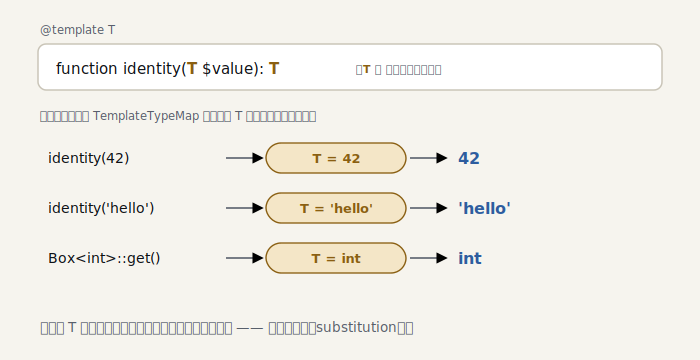

# The Seasoned ministan — S3: ジェネリクス

> ＊この章のコードはスナップショット [`impls/seasoned/03-generics`](../../../impls/seasoned/03-generics) にあります（この章の到達点は `git tag seasoned-03`）。

PHP には言語レベルのジェネリクスがありませんが、PHPDoc の `@template` で表現します。
これを解析できるかどうかが、現代の PHP 静的解析の分かれ目です（この `@template` は Hack の
ジェネリクスに源流を持ち、PHP では Psalm が先駆けました）。

> Java の型消去（erasure）や C# の具現化（reified）とも違い、PHP の `@template` は **PHPDoc＝
> コメント**なので、ランタイムは文字どおり何も認識しません。型引数は**静的解析の層にだけ
> 存在**し、実行時のメソッド解決とは独立しています。だから型安全を担保するのは*解析器の
> 責任*です —— TypeScript の `<T>` がコンパイラに支えられるのと同じ役回りを、PHP では
> PHPStan や ministan が担います。

```php
/** @template T @param T $value @return T */
function identity(mixed $value): mixed { return $value; }

$a = identity(42); // mixed ではなく、ちょうど 42 であってほしい
```

## 型変数と型引数

二つの新しい型を導入します。

- [`TemplateType`](../../../impls/seasoned/03-generics/src/Type/TemplateType.php) … 「まだ決まっていない型」`T`。
  関係判定は上限境界に委ね、同一性は名前で見る。
- [`GenericObjectType`](../../../impls/seasoned/03-generics/src/Type/GenericObjectType.php) … 型引数を伴うオブジェクト
  `Collection<int>`。`ObjectType` を**継承**するので、未定義メソッド検出などの「クラスを
  見る」処理は型引数を無視してそのまま働きます:

```php
final class GenericObjectType extends ObjectType
{
    public function __construct(string $className, public readonly array $typeArguments)
    {
        parent::__construct($className);
    }
}
```

## 置換 —— substitution

ジェネリクスの心臓は **型変数を具体型に置き換える**こと
（[`TemplateTypeMap`](../../../impls/seasoned/03-generics/src/Type/TemplateTypeMap.php)）。複合型の中まで再帰します:

```php
public function resolve(Type $type): Type
{
    if ($type instanceof TemplateType)       return $this->map[$type->name] ?? $type;
    if ($type instanceof UnionType)          return TypeCombinator::union(...array_map($this->resolve(...), $type->getTypes()));
    if ($type instanceof ArrayType)          return new ArrayType($this->resolve($type->keyType), $this->resolve($type->itemType));
    if ($type instanceof GenericObjectType)  return new GenericObjectType($type->className, array_map($this->resolve(...), $type->typeArguments));
    return $type;
}
```

## `@template` を読む

[`PhpDocTypeResolver`](../../../impls/seasoned/03-generics/src/Reflection/PhpDocTypeResolver.php) に型変数の概念を
足します。`@template T` を集め、その名前の識別子を `TemplateType` に、`Collection<int>` の
ような識別子付きジェネリックを `GenericObjectType` に解決します:

```php
private function fromIdentifier(string $name, array $templateNames): Type
{
    if (in_array($name, $templateNames, true)) {
        return new TemplateType($name, new MixedType()); // 型変数
    }
    // …組み込み型・クラス…
}
```

クラスの型変数はメソッドの `@return T` からも見えるべきなので、クラスの `@template` を
集めてメソッドの docblock 解析に渡します（[`ClassReflection`](../../../impls/seasoned/03-generics/src/Reflection/ClassReflection.php)）。

## 呼び出しで置換する

二か所で substitution が起きます（[`Scope`](../../../impls/seasoned/03-generics/src/Analyser/Scope.php)）。

**ジェネリック関数** —— 実引数から型変数を解決します（パラメータが型変数そのものの位置に
あるとき）:

```php
foreach ($expr->args as $position => $arg) {
    $paramType = $function->parameterTypes[$position] ?? null;
    if ($paramType instanceof TemplateType) {
        $map[$paramType->name] = $this->getType($arg->value); // identity(42) → T=42
    }
}
return (new TemplateTypeMap($map))->resolve($function->returnType);
```

**ジェネリッククラスのメソッド** —— 型引数を型変数に割り当てます:

```php
foreach ($class->templateNames as $i => $templateName) {
    $map[$templateName] = $objectType->typeArguments[$i]; // Box<int> → T=int
}
return (new TemplateTypeMap($map))->resolve($returnType);
```

<picture>
  <source media="(prefers-color-scheme: dark)" srcset="../figures/s3-substitution-dark.svg">
  
</picture>

## 動かす

```console
$ dev/bin/ministan annotate examples/seasoned/generics.php
    14  return : T          ← 関数本体では型変数のまま
    17  $a     : 42          ← identity(42) で T=42 に置換
    18  $b     : 'hello'
    42  $box   : Box<int>    ← @var から
    43  $value : int          ← Box<int>::get(): T を int に置換
```

型変数 `T` が、呼び出しごとに `42`・`'hello'`・`int` へと姿を変えています。

> ここでの「推論」は、型変数がそのまま現れる引数位置からの**一方向の置換（substitution）**
> です。`array<T>` の `T` を実引数から逆算するような双方向の解（単一化）はしません（実 PHPStan は
> `array_map` などでこの逆算までやります —— `dumpType()` で見えるあの推論です。ministan は
> 最小核ゆえ一方向に留め、入れ子の型変数推論は応用編の先へ）。型理論で言えば、`@template T` は
> 全称型 `∀T`、`identity(42)` の置換は型適用 `identity[42]` に当たります（TAPL / System F）。

## まとめ

- `TemplateType`（型変数）と `GenericObjectType`（型引数付きオブジェクト）を導入
- `TemplateTypeMap` が複合型の中まで再帰して型変数を置換する
- `@template` をリフレクションに取り込み、クラスの型変数をメソッドにも届ける
- 関数は実引数から、ジェネリッククラスは型引数から、型変数を解決する

> 簡略化: 入れ子の型変数推論（`array<T>` から T を逆算）、境界・変性、プロパティ型の
> 推論は見送り。ここはジェネリクスの「芯」を通すことを優先しました。

次の S4 では、S2 で宿題になった **`match` の腕での絞り込み** を含む、高度な narrowing
（早期 return・`assert`・`match`）に踏み込みます（ループの型ワイドニングは S7 へ）。
