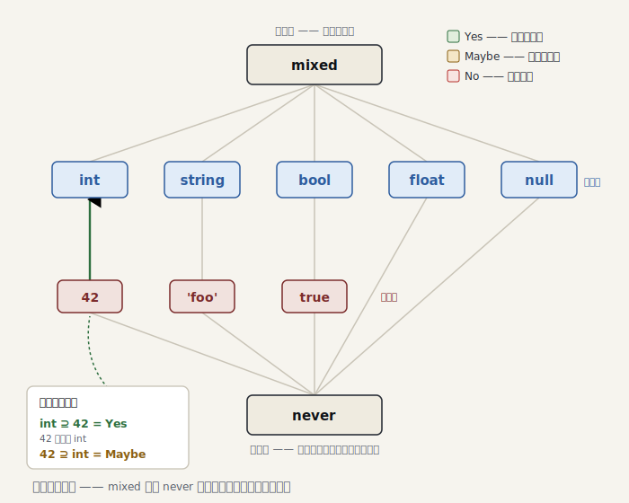

# Part 3 — 型システムの基礎

> ＊この章のコードはスナップショット [`impls/wonderland/03-type-system`](../../../impls/wonderland/03-type-system) にあります（この章の到達点は `git tag part-03`）。

> 参考書（任意）：『しくみ』7 章「部分型付け」／TAPL 15 章「部分型付け」（`mixed`／`never` ＝ Top／Bottom は §15.4）。型を **値の集合** とみて `isSuperTypeOf`／`accepts` で包含を問うのが部分型関係です。

Part 2 の `Scope` は「変数が定義済みか否か」しか知りませんでした。これを **型** へ
育てる前に、まず型そのものを表す語彙を作ります。本章はルールに繋がない、純粋な
**型の代数** の章です。単体テストで関係を確かめながら積み上げます。

## 型は「値の集合」

型を「値の集合」と考えると、すべてが素直になります。

- `int` … すべての整数の集合
- `42` … ただ一つの値 `42` だけの集合（**定数型**）
- `mixed` … すべての値の集合（最上位）
- `never` … 空集合（最下位、決して起こらない）

すると型どうしの関係は集合の包含で表せます。`42 ⊆ int ⊆ mixed`。この包含を問うのが
`isSuperTypeOf()` です。

<picture>
  <source media="(prefers-color-scheme: dark)" srcset="../figures/03-type-lattice-dark.svg">
  
</picture>

## 三値論理 —— 「たぶん」を一級市民に

包含の答えは Yes/No では足りません。`int` は `mixed` を含む**かもしれない** ——
mixed の中身が int かどうかは実行時まで分からないからです。この「たぶん」を表すのが
[`TrinaryLogic`](../../../impls/wonderland/03-type-system/src/TrinaryLogic.php)（PHPStan の `TrinaryLogic` に対応）:

```php
enum TrinaryLogic
{
    case Yes;
    case Maybe;
    case No;
    // and / or / negate …
}
```

なぜ enum 一つにこだわるのか。**レベル制がこの軸に乗る**からです。低いレベルでは
「No（確実に違反）」だけを報告し、「Maybe」は見逃す。レベルを上げるほど「Maybe」も
咎める。non-rejecting の哲学そのものが、この三値で表現されます（Part 8 で回収）。

> 参考書メモ：『しくみ』7 章は部分型を `subtype(a, b)` の **`true`／`false` 二値** で答えました
> （TAPL 15 章の部分型関係 `S <: T` も同じく成り立つ／成り立たないの二値）。ministan は同じ問いに
> 三つ目「**`Maybe`**」を足します —— この一手が、低レベルでは黙り高レベルで咎めるレベル制（Part 8）と
> non-rejecting の土台になります。動的言語に「分からない」は付きものだからです。

## `Type` インターフェイス

ルールが PHPStan の心臓なら、型システムの中核は
[`Type`](../../../impls/wonderland/03-type-system/src/Type/Type.php) です。3 つの問いに答えます:

```php
interface Type
{
    public function describe(): string;                  // 'int', '42', 'mixed' …
    public function isSuperTypeOf(Type $type): TrinaryLogic; // 部分型関係
    public function accepts(Type $type): TrinaryLogic;       // 代入可能性
    public function equals(Type $type): bool;
}
```

`isSuperTypeOf`（自分は相手の上位集合か）と `accepts`（自分の場所に相手を入れてよいか）は
似て非なるものですが、単純な値型では一致します。そこで共通処理は
[`SimpleTypeTrait`](../../../impls/wonderland/03-type-system/src/Type/SimpleTypeTrait.php) に括り出し、`accepts` は
`isSuperTypeOf` に委譲します。上端 `mixed`・下端 `never` との関係も共通なので、
そこも trait の `relateToTopAndBottom()` に集約します:

```php
protected static function relateToTopAndBottom(Type $type): ?TrinaryLogic
{
    if ($type instanceof NeverType) return TrinaryLogic::Yes;  // never は全型の部分型
    if ($type instanceof MixedType) return TrinaryLogic::Maybe; // mixed はこの型かもしれない
    return null; // どちらでもなければ各型の固有判定へ
}
```

おかげで `int` の本体はこれだけです:

```php
public function isSuperTypeOf(Type $type): TrinaryLogic
{
    return self::relateToTopAndBottom($type)
        ?? (($type instanceof self || $type instanceof ConstantIntegerType)
            ? TrinaryLogic::Yes
            : TrinaryLogic::No);
}
```

## 定数型こそが鋭さの源

`$x = 42;` の直後、$x の型は `int` でしょうか？ いいえ、**`42`** です。この区別が
静的解析の切れ味を決めます。`42` という型を持てるから、`match` の網羅性や到達不能な
分岐まで論じられる。

[`ConstantIntegerType`](../../../impls/wonderland/03-type-system/src/Type/Constant/ConstantIntegerType.php) の関係づけは
集合の直感どおりです:

```php
match (true) {
    $type instanceof self        => $this->value === $type->value ? Yes : No, // 42 ⊇ 42, 42 ⊉ 43
    $type instanceof IntegerType => TrinaryLogic::Maybe, // 一般の int は、たまたま 42 かも
    default                      => TrinaryLogic::No,
};
```

`int ⊇ 42` は Yes（42 は必ず int）。逆に `42 ⊇ int` は Maybe（int はたまたま 42 かも
しれないが、そうとは限らない）。この非対称性が型の向きを正しく捉えます。

## テストで関係を固める

ルールに繋がない章なので、検証は型代数の単体テストです
（[`TypeTest`](../../../impls/wonderland/03-type-system/tests/Type/TypeTest.php)）。包含の真理値表を素直に並べます:

```php
yield 'int ⊇ 42'    => [$int, new ConstantIntegerType(42), TrinaryLogic::Yes];
yield 'int ⊉ string'=> [$int, $string,                     TrinaryLogic::No];
yield 'int ⊇? mixed'=> [$int, $mixed,                      TrinaryLogic::Maybe];
yield '42 ⊇? int'   => [new ConstantIntegerType(42), $int, TrinaryLogic::Maybe];
yield 'never ⊉ mixed' => [$never, $mixed,                  TrinaryLogic::No];
```

## まとめ

- 型は **値の集合**。包含関係を `isSuperTypeOf()` で、代入可能性を `accepts()` で問う
- 答えは三値（`TrinaryLogic`）。**「たぶん」を一級市民にする**ことがレベル制の土台
- `mixed`（最上位・「分からない」の縮退先）と `never`（最下位）が型束の両端
- **定数型**（`42`, `'foo'`, `true`）が解析の切れ味を生む

次の Part 4 では、この語彙をついに `Scope` と結びます。`Scope::getType(Expr): Type` を
実装し、リテラルや二項演算から式の型を **推論** します。そして推論結果を見せる
`ministan annotate` コマンドを追加します。
